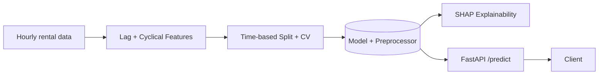

<div align="center">

# 🚲 Bike-Share Demand Forecasting

**Hourly rental demand prediction with honest time-series validation, SHAP explainability, and a FastAPI serving layer — containerized and CI-tested.**

[](.github/workflows/ci.yml)
[](pyproject.toml)
[](api/main.py)
[](src/train.py)
[](docker/Dockerfile)
[](LICENSE)

</div>

---

## Overview

Bike-share and micromobility operators (Citi Bike, Capital Bikeshare, Lyft's bike/scooter fleets) run demand forecasting continuously to decide **fleet rebalancing** — trucking bikes between stations overnight so popular stations aren't empty at 8am and unpopular ones aren't overflowing. Getting this wrong either strands riders (lost revenue, bad reviews) or wastes rebalancing-truck operating costs. This repository is a compact, working version of that forecasting layer: real hourly rental data, engineered time-series features, a model validated the way forecasting models actually need to be validated, and a FastAPI endpoint that scores demand for a given hour.

## Business problem

| | |
|---|---|
| **Who faces it** | Bike-share/scooter-share operators, any business with time-varying, weather- and calendar-sensitive demand |
| **Why it matters** | Rebalancing decisions, staffing, and inventory all depend on an accurate near-term demand forecast |
| **Current industry approach** | Gradient-boosted trees or specialized forecasting models (Prophet, ARIMA, deep learning) on engineered lag/calendar/weather features, validated with time-aware backtesting |
| **Where this project fits** | Demonstrates the core of that pipeline: correct time-series feature engineering, leakage-free validation, and a baseline-beating model — the fundamentals that matter more than model choice |

## Architecture



Full architecture, the time-series validation diagram, and design rationale: **[docs/architecture.md](docs/architecture.md)**.

## Project structure

```
bikeshare-demand-forecasting/
├── src/                    # ingest, features, train, explain, predict, config, logger
├── api/                    # FastAPI service (main.py, pydantic schemas)
├── tests/                  # pytest: features, time-based split correctness, training, API
├── configs/config.yaml     # Single source of truth for paths & hyperparameters
├── data/                   # Ingested raw + engineered CSVs (+ README documenting provenance)
├── models/                 # Persisted model.joblib / preprocessor.joblib
├── artifacts/              # metrics.json, SHAP summary plot
├── docker/Dockerfile       # Ingests + trains at build time
├── docker-compose.yml
├── .github/workflows/ci.yml
├── docs/architecture.md    # Mermaid architecture + time-series validation diagrams
├── Makefile
├── pyproject.toml
└── requirements.txt
```

## Dataset

**Real**, not synthetic: the UCI "Bike Sharing Dataset" (Fanaee-T & Gama, 2013) — 17,379 hours of Capital Bikeshare (Washington, D.C.) rentals across 2011–2012, joined with weather and calendar data. CC BY 4.0 licensed. Full provenance and citation: **[data/README.md](data/README.md)**.

## Model & results

`HistGradientBoostingRegressor` on lag/rolling/cyclical/weather features, validated with **time-series-aware** splitting (never random) — see [docs/architecture.md](docs/architecture.md) for why this matters. Held-out test set: the most recent 120 days (2012-09-03 to 2012-12-31, 2,840 hours), completely unseen during training.

| Model | MAE | RMSE | MAPE |
|---|---|---|---|
| **HistGradientBoostingRegressor (this model)** | **30.0** | 48.5 | 24.8% |
| Ridge regression (linear baseline) | 58.9 | 89.3 | 72.5% |
| Seasonal-naive ("same hour last week") | 85.3 | 147.6 | 154.2% |

**The trained model reduces MAE by 64.8% versus the seasonal-naive baseline** — the honest bar any forecasting model has to clear to be worth deploying. 5-fold expanding-window cross-validation MAE: 31.5 ± 8.8 (std reflects real variance across different months/seasons, not overfitting to one lucky split). Full report: [artifacts/metrics.json](artifacts/metrics.json).

> **Reproducibility note:** `HistGradientBoostingRegressor`'s internal histogram binning has a tiny amount of run-to-run floating-point non-determinism even with a fixed `random_state` (a known characteristic of its threaded implementation) — expect MAE to vary by roughly ±1 across runs, not the numbers shifting due to any bug.

## Explainability

`src/explain.py` computes SHAP values on a sample of test-period hours and saves a summary plot (`artifacts/shap_summary.png`) — useful for confirming the model leans on sensible signals (recent demand, hour-of-day, weather) rather than spurious ones.

```bash
make explain
```

## Installation & usage

```bash
git clone <YOUR_GITHUB_URL>
cd bikeshare-demand-forecasting
python -m venv .venv && source .venv/bin/activate
make install    # pip install -r requirements.txt
make train       # ingest -> feature engineer -> time-based split -> train -> evaluate
make explain      # optional: SHAP summary plot
make test          # pytest with coverage
make api            # runs the API locally at http://localhost:8000
```

Interactive API docs (Swagger UI): **http://localhost:8000/docs**

### Example request

```bash
curl -X POST http://localhost:8000/predict \
  -H "Content-Type: application/json" \
  -d '{
    "temp": 0.5, "atemp": 0.48, "hum": 0.6, "windspeed": 0.2,
    "lag_1": 120, "lag_24": 140, "lag_168": 135,
    "roll_mean_24": 95.0, "roll_mean_168": 110.0,
    "hour_sin": 0.965, "hour_cos": -0.258,
    "month_sin": 0.5, "month_cos": 0.866,
    "weekday_sin": 0.781, "weekday_cos": 0.623,
    "season": 2, "weathersit": 1, "holiday": 0, "workingday": 1
  }'
```

```json
{"predicted_count": 307}
```

> **Scope note:** this endpoint scores a single hour given its recent actual demand history (a "nowcast"), not a full autoregressive multi-step forecast — see Future Work for how to extend it to N-hours-ahead forecasting.

## Deployment (Docker)

```bash
docker compose up --build
```

The image ingests data and trains the model at build time, so `docker run` serves immediately.

> Note: the Dockerfile was validated by syntax/build-plan review in this build environment (no Docker daemon available in the sandbox); the underlying ingest → train → `uvicorn` pipeline was verified end-to-end by running each step directly and hitting the live API with curl. Please run `docker compose up --build` locally to confirm before deploying.

## Testing & CI

20 tests (feature engineering, time-based split correctness, training pipeline, baseline comparisons, API endpoints including validation errors) run automatically on every push via **[.github/workflows/ci.yml](.github/workflows/ci.yml)** across Python 3.10 and 3.11, followed by a Docker build job. Notably, `test_model_beats_seasonal_naive_baseline` fails the build if a future change makes the model *worse* than the trivial baseline.

```bash
make test
```

## API reference

| Endpoint | Method | Description |
|---|---|---|
| `/health` | GET | Liveness/readiness probe, reports whether the model is loaded |
| `/predict` | POST | Predict rental demand for one hour given weather/calendar/lag features |
| `/docs` | GET | Swagger UI (auto-generated OpenAPI spec) |

Full request/response schemas: [`api/schemas.py`](api/schemas.py).

## Future work

- Extend to true multi-step forecasting (predict the next 24–168 hours recursively, feeding each prediction back in as the next hour's lag feature, with uncertainty growing appropriately over the horizon)
- Add per-station (rather than system-wide) forecasts for actual rebalancing routing
- Compare against dedicated forecasting libraries (Prophet, statsmodels SARIMAX, or a temporal deep learning model) as additional baselines
- Add drift monitoring — demand patterns shift with weather-pattern changes, city growth, and competing transit options
- Kubernetes deployment + horizontal scaling for a citywide multi-station version of this service

## License

MIT for this repository's code — see [LICENSE](LICENSE). The dataset is CC BY 4.0 licensed by its original authors; see [data/README.md](data/README.md) for citation.

## Contact

**Muhammad Farooq Shafi**
📧 mfarooqsgafee333@gmail.com
💼 [LinkedIn](https://www.linkedin.com/in/muhammadfarooqshafi/)
📘 [Facebook](https://www.facebook.com/profile.php?id=61575167257313)
🔗 GitHub: https://github.com/Muhammad-Farooq13
