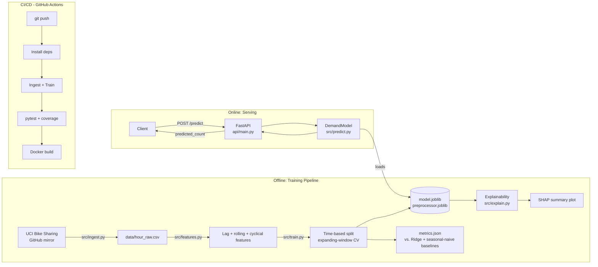
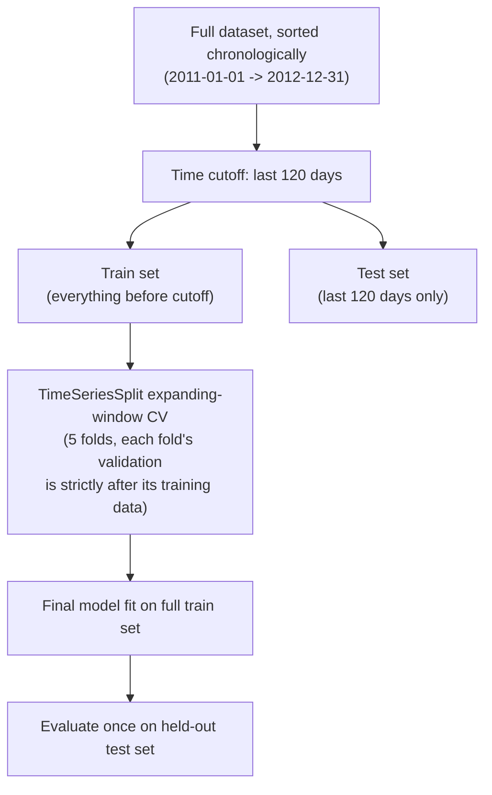

# Architecture

## System overview

## Time-based validation (the part most tutorials get wrong)

A **random** train/test split or plain K-fold CV on a time series lets the
model train on rows that happen to fall chronologically *after* some of its
validation rows — e.g. training on 3pm data from a Tuesday while "predicting"
9am from the same day. That leaks information no real deployment would ever
have, and inflates validation scores in a way that doesn't survive contact
with production. This project uses:

- A hard **chronological cutoff** for the final train/test split (test = the
  most recent 120 days, exactly as if this were deployed today and asked to
  forecast the next few months)
- **`TimeSeriesSplit`** (expanding-window CV) instead of `KFold` for
  hyperparameter/model validation during development

## Design decisions

| Decision | Rationale |
|---|---|
| Lag features (1h, 24h, 168h) + rolling means | The single strongest predictor of "bikes rented this hour" is "bikes rented recently" — lag features let a tree-based model exploit that directly instead of re-deriving it from raw calendar fields. |
| Cyclical (sin/cos) encoding of hour/month/weekday | Hour 23 and hour 0 are one hour apart in reality but far apart as raw integers; sin/cos encoding preserves that adjacency, which matters for late-night demand patterns. |
| `HistGradientBoostingRegressor` vs a linear baseline | Demand has non-linear interactions (e.g. weather matters much more on weekends than on commute-heavy weekdays); the results table shows the tree model beating a comparable linear (Ridge) model by a wide margin, which justifies the extra complexity. |
| Explicit seasonal-naive baseline ("same hour last week") | Any forecasting model needs a trivial baseline to beat, or its apparent skill is illusory. This project reports the naive baseline's error alongside the model's, and tests (`test_model_beats_seasonal_naive_baseline`) enforce that the trained model actually outperforms it. |
| Single `ColumnTransformer` persisted with the model | Same rationale as any production ML system — eliminates train/serve skew. |
| API takes pre-computed lag/rolling features rather than raw timestamps | This project scores a single hour given its recent history (a "nowcast"/point regression), not a full autoregressive multi-step forecast — clearly documented as a scope boundary, with the natural extension (recursive multi-step forecasting) noted in Future Work. |

## Data flow

1. `src/ingest.py` downloads the real UCI Bike Sharing hourly dataset from a GitHub mirror.
2. `src/features.py` builds lag features, rolling means, and cyclical encodings, dropping the earliest 168 rows that lack a full week of history.
3. `src/train.py` performs a chronological train/test split, runs expanding-window CV, trains `HistGradientBoostingRegressor`, and compares it against a Ridge regression baseline and a seasonal-naive baseline.
4. `src/explain.py` computes SHAP values on a sample of test-period hours.
5. `api/main.py` loads the persisted artifacts once at startup and serves `/predict` and `/health`.
